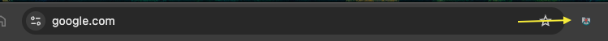
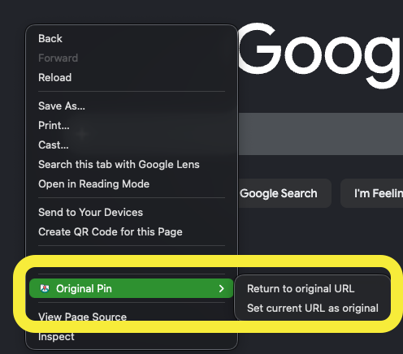

# Original Pin

Original Pin is a Chrome web extension that remembers the URL a tab had when it became pinned and lets you return that pinned tab to the remembered URL.

Chrome extensions cannot observe `Command`/`Control` + clicks on Chrome's own tab strip, so this extension uses Chrome-supported triggers instead:

- `Command+Shift+Y` on macOS, or `Ctrl+Shift+Y` on Windows/Linux, restores the currently active pinned tab.
- Click the extension action while a pinned tab is active.
- Context menu entries are registered for page right-click menus.

The extension also provides a context menu action to set the current URL as the saved original URL when the browser exposes that menu entry.

## Example

### Just click to restore

After loading the extension, the toolbar action appears next to the address bar as a pin icon. When a pinned tab is active, click that toolbar action to return the tab to its saved original URL.



### Right-click menu

You can also right-click on a page while a pinned tab is active and open the `Original Pin` submenu. From there:



- `Return to original URL` restores the pinned tab to the URL it had when it was pinned.
- `Set current URL as original` replaces the saved original URL with the current page URL.

## Local Development

Run checks:

```sh
npm test
npm run check
```

Load the repository folder as an unpacked extension from `chrome://extensions`. For automated local testing, use Chrome for Testing or Chromium; current stable Google Chrome branded builds no longer load unpacked extensions through `--load-extension`.

## License

MIT
